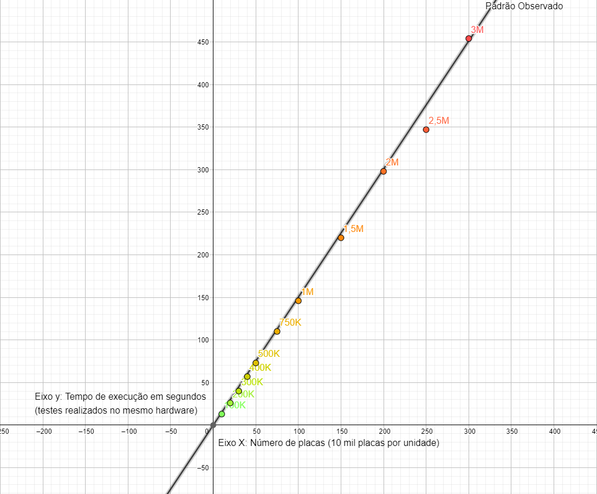

# Procura-se Veículos - Solução
*Por Lucas Teixeira Borges*
## Demanda:
Implementação de um algoritmo capaz de ordenar lexicograficamente placas no padrão Mercosul (LLLNLNN) eficientemente, de forma que seja viável a ordenação de um grande número de placas.

## Algoritmo implementado:
O algoritmo utilizado foi uma adaptação do já existente *Radix Sort*, um algoritmo de ordenação que utiliza o *Counting Sort* como sub-rotina para realizar a ordenação de um grupo de dados. O *Counting Sort* ordena com base em um dígito específico do dado e presume que o intervalo dos dados é conhecido, e não se baseia na realização de comparações, mas na contagem de ocorrências de um determinado algarismo no número fornecido[1]. O algoritmo foi implementado de forma que ele também funcione com letras, que são interpretadas como números de 0 a 25 (representando o alfabeto de A a Z). O *Counting Sort* ordena com base em um dígito apenas e utiliza como "critério de desempate" a posição da placa no vetor. O *Radix Sort* aplica o *Counting Sort* para cada um dos dígitos, começando do LSD (Dígito Menos Significante) e indo até o MSD (Dígito Mais Significante)[2].

## Escolha do Algoritmo
Considerando um conjunto universo possível de quase 457 milhões de placas, algoritmos baseados em comparações se mostraram inviáveis para a ordenação de um número tão grande de placas considerando que o algoritmos mais eficientes possuem complexidade `O(nlogn)`, e para um número tão grande de placas foi interessante buscar um algoritmo de crescimento linear para ser aplicado. O *Radix Sort* possui complexidade `O(n)`, foi apenas necessário garantir que nossos dados cumpriam os pré-requisitos para a utilização do algoritmo, e é o caso[3].
Por não ser baseado em comparações, o *Radix Sort* é comumente analisado pela sua complexidade de tempo, ao contrário dos algoritmos que se baseiam no número de comparações realizadas para definir sua complexidade. Tendo isso em mente, o arquivo `testeTempo.py` foi adicionado: um código capaz de testar o tempo de execução do algoritmo implementado em função do número de placas utilizadas através da geração de uma lista de placas aleatórias. Para maior precisão dos resultados, cada caso é testado duas vezes e o programa calcula a média dos retornos. Colocando esses resultados num gráfico, é possível traçar um padrão no crescimento do tempo de execução do programa em função do número de placas ordenadas:

Figura 1 - Gráfico mostrando os resultados obtidos nos testes.

A partir dos resultados, foi possível observar uma tendência de crescimento linear, condizente com o esperado por ser um algoritmo de complexidade da ordem `O(n)`.
Outro fator que influenciou a escolha do *Radix Sort* foi a possibilidade do algoritmo para obter um speed-up significante dado o seu potencial para o paralelismo[4].

## Uso do programa
Para fazer uso do código basta editar o arquivo `PIVs.piv`, substituir as placas que estão lá pelas placas que devem ser ordenadas (colocando uma por linha) ou criar um novo arquivo com uma placa padrão mercosul por linha e colocá-lo no diretório do programa e executar o arquivo `main.py`.  O programa irá pedir pro usuário inserir o nome do arquivo. Caso o campo seja deixado em branco o programa automaticamente busca o arquivo PIVs.piv. Após o aguardo paciente do processo de ordenação, um arquivo `PIVsord.piv` será criado na mesma pasta. Caso não seja a primeira vez que o programa seja executado, é possível que já exista um arquivo com esse nome no diretório. Nesse caso, ele não será alterado e o novo arquivo será renomeado para `PIVsord(1).piv` ou o nome `PIVsord(x).piv` que estiver disponível. 

## Referências
[1] **Counting Sort**. Geeks for Geeks, atualizado em 27 set. 2022. Disponível em: <https://www.geeksforgeeks.org/counting-sort/>.

[2] CUNHA, Ítalo. **Ordenação: Radix Sort**. UFMG, 2012. Disponível em: <https://homepages.dcc.ufmg.br/~cunha/teaching/20121/aeds2/radixsort.pdf>.

[3] **Radix Sort**. Geeks for Geeks, atualizado em 09 ago. 2022. Disponível em: <https://www.geeksforgeeks.org/radix-sort/>.

[4] N. Satish, M. Harris, and M. Garland. **Designing efficient sorting algorithms for manycore GPUs**. NVIDIA Technical Report NVR-2008-001, September 2008. Disponível em: <https://mgarland.org/files/papers/nvr-2008-001.pdf>.

